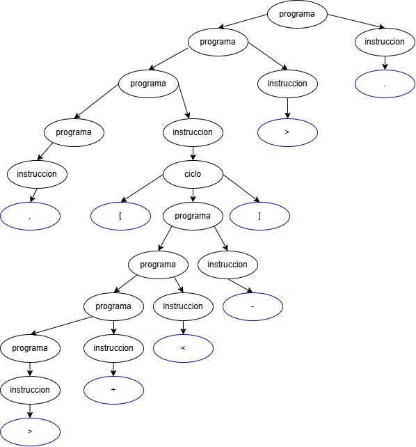
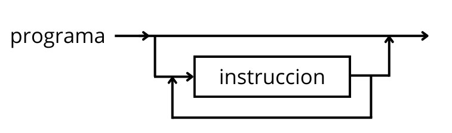
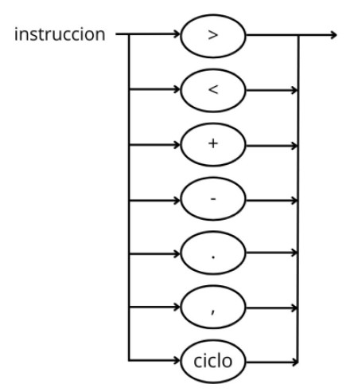
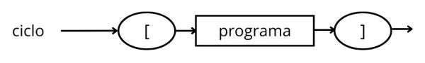

## Actividad 4

Realizar el árbol de análisis sintáctico de un programa fuente, y por cada producción realizar el diagrama sintáctico del lenguaje.

### Lenguaje seleccionado: Brainfuck

### Programa en Brainfuck  `,[>+<-].`

Suponemos que el usuario introduce un espacio (`' '`), cuyo valor ASCII es 32.

#### Estado inicial
- La memoria es una cinta infinita de celdas, todas inicializadas en 0.
- El puntero comienza en la celda 0.

#### `,` — Leer entrada
- Se lee un carácter desde la entrada estándar.
- En este caso, el usuario ingresa un espacio (`' '`, ASCII 32).
- Ese valor (32) se guarda en la celda 0.

Estado de memoria:
Celda 0: 32
Celda 1: 0

#### `[` — Comienzo del ciclo
- Verifica si el valor actual (celda 0) es distinto de 0.
- Como es 32, entra en el ciclo.

#### `>` — Mover a la derecha
- El puntero se mueve a la celda 1.

#### `+` — Incrementar
- Incrementa el valor de la celda 1 en 1.

Nuevo estado:
Celda 0: 32
Celda 1: 1

#### `<` — Mover a la izquierda
- El puntero vuelve a la celda 0.

#### `-` — Decrementar
- Disminuye el valor de la celda 0 en 1.

Nuevo estado:
Celda 0: 31
Celda 1: 1

#### `]` — Fin del ciclo

- Como la celda 0 sigue siendo distinta de 0, vuelve al `[` para repetir.

#### Repetición del ciclo `[>+<-]`
Este bucle se repite hasta que la celda 0 llegue a 0.

En cada iteración:
- Se resta 1 a la celda 0.
- Se suma 1 a la celda 1.

Después de 32 iteraciones:

Celda 0: 0
Celda 1: 32

#### `.` — Imprimir salida
- Se imprime el carácter ASCII correspondiente al valor de la celda actual (celda 0).
- Como la celda 0 vale 0, se imprime el carácter ASCII 0, que no es visible (carácter nulo).

####  Resultado final

| Celda   | Valor |
|---------|-------|
| Celda 0 | 0     |
| Celda 1 | 32    |

- Entrada: espacio (`' '` → ASCII 32)
- Salida visible: nada (se imprime carácter nulo)
- Efecto del programa: transfiere el valor de la celda 0 a la celda 1 y deja la celda 0 en cero.

### ,[>+<-].

### Árbol sintáctico

### Diagramas sintácticos

